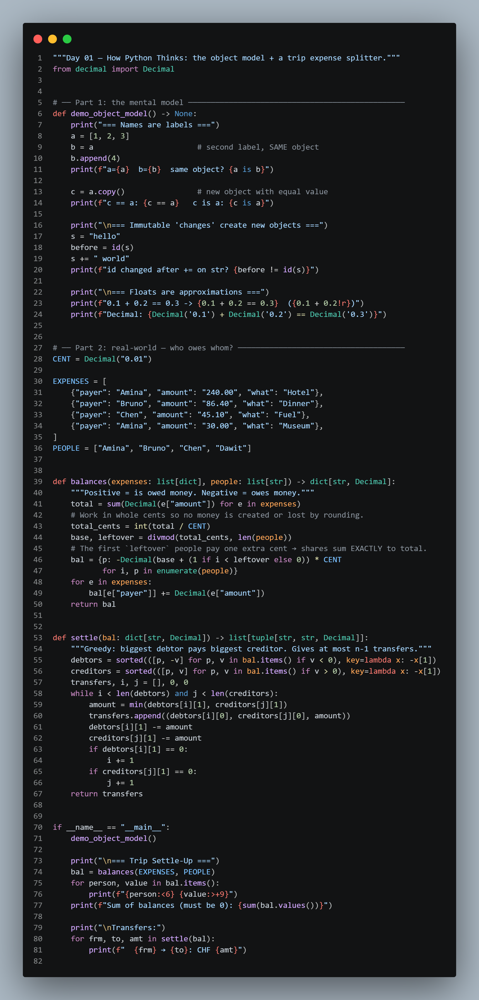
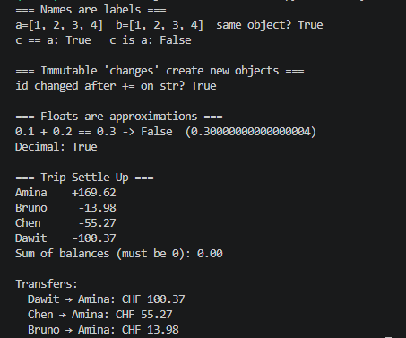

# Day 01 — How Python Thinks

## 🎯 Goal
Build the mental model that explains 80% of Python's "weird" behavior.

## 🧠 First Principles

**1. Everything is an object.** Every value — `42`, `"hi"`, a function, a class — is an object with three things:

| Property | Question it answers | Check with |
|---|---|---|
| Identity | *Which* object is it? | `id(x)`, `x is y` |
| Type | *What can it do?* | `type(x)` |
| Value | *What does it hold?* | `x == y` |

**2. Variables are labels, not boxes.** `b = a` does **not** copy — it sticks a second label on the same object.

```
a ──┐
    ├──► [1, 2, 3]      b.append(4) changes what a "sees" too
b ──┘
```

**3. Mutable vs immutable.**
- Immutable (can't change in place): `int, float, str, tuple, bool, None`
- Mutable: `list, dict, set`, most custom objects

"Changing" a string actually creates a **new** object. Changing a list modifies the **same** object.

**4. Floats are binary approximations.** `0.1 + 0.2 != 0.3`. Never use `float` for money — use `Decimal`.

## 🌍 Real-World Scenario
Four friends go on a trip. Different people paid for different things. **Who owes whom, with the fewest transfers?** (This is the core of apps like Splitwise.)

## 💻 Code
```bash
python main.py
```
`main.py` demonstrates the mental model, then solves the scenario with `Decimal` and a greedy settle-up algorithm.

> 🐛 **Real bug worth knowing:** splitting CHF 401.50 four ways and rounding each share *loses cents*. The fix used here (and by real payment systems) is to work in **integer cents** and hand the leftover cents to the first few people, so the shares always sum exactly to the total.




## 🏋️ Exercises
1. Predict, then run: `x = [[0] * 3] * 3; x[0][0] = 1; print(x)`. Explain using labels.
2. Add a `"shared_by"` field so an expense can be split among only some people.
3. Replace `Decimal` with `float` and find a case where the totals no longer balance to zero.

## ✅ Takeaways
- `is` compares identity, `==` compares value.
- Assignment never copies. Use `.copy()` or `copy.deepcopy()` explicitly.
- Money → `Decimal`. Always.
