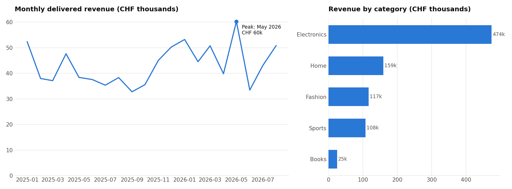

# Day 11 — Data Analysis (NumPy, pandas, matplotlib)

## 🎯 Goal
Go from a raw CSV to business answers and a clean chart — the daily work of every data analyst and ML engineer.

## 🧠 First Principles

**1. Vectorize: operate on whole columns, not rows.** A Python loop handles one number at a time, with type checks on each. NumPy stores numbers in one contiguous block of memory and runs one compiled C loop over it.
```python
[p * 1.077 for p in prices]   # 2M Python operations
prices * 1.077                # 1 NumPy operation → often 10–100× faster
```
If you write `for row in df.iterrows()`, stop and look for the column operation.

**2. A DataFrame is a dict of aligned columns (Series) sharing one index.** Nearly every analysis is three verbs:

| Verb | pandas | SQL equivalent |
|---|---|---|
| **Filter** rows | `df[df.status == "delivered"]` | `WHERE` |
| **Group** & aggregate | `df.groupby("category")["revenue"].sum()` | `GROUP BY` |
| **Reshape** | `pivot_table`, `merge`, `melt` | `JOIN`, `PIVOT` |

**3. Clean before you compute.** Duplicates, negative quantities, missing values — each silently skews totals. Always print row counts before/after cleaning.

**4. A chart must answer one question.** Title = the question. One color unless color *means* something. No 3D, no dual y-axes.

## 🌍 Real-World Scenario
An online shop (5,000 orders, 5 countries, 20 months — synthetic but realistic, with dirty rows) asks:
1. How is revenue trending month by month?
2. Which categories make the money? Which get returned most?
3. Which country × category combinations matter?
4. How dependent are we on our top customers (Pareto)?

> 🐛 **Trap caught in this project:** the data ends on 12 September, so September shows a huge "drop". It isn't a crash; the month just isn't finished yet. The code detects and excludes the incomplete month. Real dashboards get this wrong all the time.

## 💻 Code
```bash
python main.py        # prints the report, saves output/sales_report.png
```
Tip: open `main.py` in VS Code and use the **Jupyter Interactive Window** (`# %%` cells) or a notebook to explore step by step.




## 🏋️ Exercises
1. Add a 3-month rolling average to the monthly revenue (`.rolling(3).mean()`).
2. Compute month-over-month growth in % and find the best month.
3. Which customers ordered in 2025 but **not** in 2026 (churned)? Hint: sets or `merge(..., indicator=True)`.
4. Answer question 2 again in SQL: `import sqlite3; df.to_sql(...)`, then `pd.read_sql(...)`.

## ✅ Takeaways
- Think in columns, not loops.
- Filter → group → aggregate answers most business questions.
- Check your data's edges (dates, duplicates, nulls) before you believe a chart.
