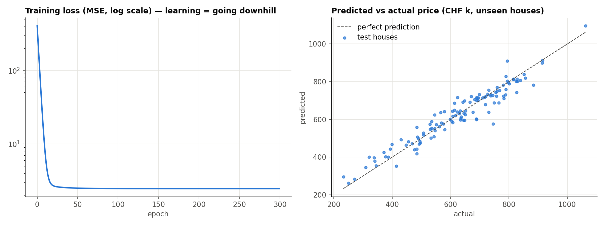

# Day 12 — Machine Learning From Scratch

## 🎯 Goal
Understand what "training a model" *actually* means by building one with nothing but NumPy — then confirm it against scikit-learn.

## 🧠 First Principles

**1. A model is a function with adjustable knobs (parameters).**
```
price = w₁·size + w₂·rooms + w₃·age + w₄·distance + b
```
Training = finding the knob values that make the predictions least wrong.

**2. "Wrong" must be a single number: the loss.** Mean Squared Error = average of (prediction − truth)². Squaring punishes big misses and makes the math smooth.

**3. Learning = minimizing error by following the slope.** Imagine standing on a foggy hill (the loss surface). You can't see the bottom, but you can feel which way is downhill — that's the **gradient**. Take a small step that way (size = **learning rate**). Repeat.
```
w ← w − learning_rate × ∂loss/∂w
```
That single line trains linear regression, logistic regression **and** GPT-sized neural networks. Only the function and the scale change.

**4. Judge on unseen data.** A model that memorises its training data is useless. Always hold out a **test set**, and compare with a dumb **baseline** ("always predict the average") — if you can't beat it, you've learned nothing.

**5. Scale features.** Size (~100) and age (~40) live on different scales; without standardising, one learning rate can't suit both, and descent zig-zags or explodes.

**Metrics in plain words**
| Metric | Meaning |
|---|---|
| MAE | "On average we're off by CHF X" — easiest to explain to a boss |
| RMSE | Like MAE but punishes big misses more |
| R² | Share of the variation explained (1.0 = perfect, 0 = no better than the average) |

## 🌍 Real-World Scenario
A real-estate platform wants an instant price estimate ("Zestimate"-style) for 600 listed homes from size, rooms, age and distance to the center.

## 💻 Code
```bash
python main.py
```
The data is synthetic, generated with *known* true prices per unit (CHF 4,000/m², −1,500/year…). The model recovers them almost exactly from noisy data. That's the proof it learned.




## 🏋️ Exercises
1. Set `lr=1.5`. What happens to the loss? Then try `lr=0.001`. Explain both with the hill picture.
2. Remove the `StandardScaler`. Why does training break?
3. Implement **mini-batch** gradient descent (use 32 random rows per step). This is how all deep learning trains.
4. Add a feature `size_m2²` — does R² improve? This is how linear models capture curves.

## ✅ Takeaways
- Model = function + parameters. Training = descend the loss.
- Always: train/test split, baseline, then metrics.
- Fit preprocessing on training data only (otherwise you leak test information).
