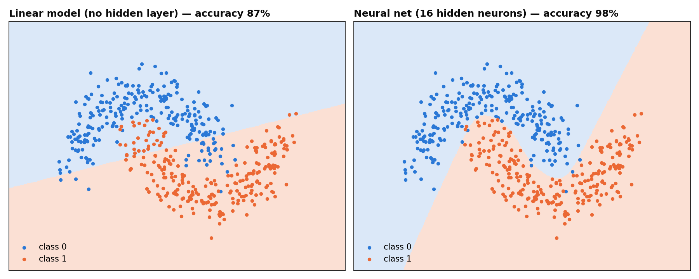

# Day 14 — AI: Neural Networks & LLM Apps

## 🎯 Goal
Demystify the two things behind today's AI: **neural networks** (how models learn complex patterns) and **LLM applications** (how products like support chatbots actually use them).

## 🧠 First Principles

### Part A — Neural networks
**1. A neuron is a tiny linear model plus a bend.** `output = bend(w·x + b)`. Without the bend (tanh, ReLU…), stacking layers is pointless: linear on linear is still just a line.

**2. Layers of bends can draw any shape.** Each hidden neuron draws one line and bends it. Combine 16 of them and the network can curve its boundary around the data.

**3. Backpropagation is just the chain rule.** The error at the output is passed backwards, layer by layer, telling every weight how much it contributed. Then it's the same downhill step as Day 12:
```
w ← w − learning_rate × gradient
```
PyTorch and TensorFlow automate exactly this (autograd) for millions of neurons on GPUs.

### Part B — LLM apps (RAG)
**4. An LLM predicts the next token from its context.** It only "knows" its training data plus **what you put in the prompt**. Ask it about your company's return policy and it will guess: fluently, and sometimes wrongly (a *hallucination*).

**5. RAG = search + prompt.** Retrieval-Augmented Generation:
```
question ─► embed ─► find nearest document chunks ─► put them in the prompt ─► LLM answers from them
```
- **Embedding** = text → vector, so similar meaning ≈ nearby vectors.
- **Vector search** = cosine similarity against every chunk (a "vector database" does this at scale).
- **Grounding** = "answer ONLY from this context, cite it, say *I don't know* otherwise".

Most enterprise AI products (support bots, internal search, "chat with your docs") are this pipeline.

## 🌍 Real-World Scenarios
- **A:** Separate two interleaved customer segments that no straight line can split.
- **B:** A support bot for a (fictional) bike shop, **Nordwind Bikes**, answering from its policy documents in `docs/`.

## 💻 Code
```bash
python neural_net.py                        # NN from scratch vs linear model
python rag.py                               # retrieval demo, no API key needed
python rag.py "Is shipping free?"           # your own question
pip install anthropic
export ANTHROPIC_API_KEY=sk-ant-...         # optional: generate real answers with Claude
python rag.py "Can I return a worn helmet?"
```




> 🔍 **Look closely at the RAG output.** For *"a helmet I already wore"*, the best chunk ("worn helmets cannot be returned") ranks only **second**. "Wore" ≠ "worn" to a keyword-based embedding. Same for *"storage"* vs *"store"*. That's exactly why production systems use **neural embeddings**, which understand that these mean the same thing.

## 🏋️ Exercises
1. In `neural_net.py`, remove `np.tanh` (make the hidden layer linear). What happens to accuracy? Why?
2. Try `hidden=2` and `hidden=64`. When does it start to overfit?
3. Replace `TfidfEmbedder` with `sentence-transformers` (`all-MiniLM-L6-v2`) and compare the rankings for the helmet question.
4. Add a `docs/opening_hours.md` file. No code change should be needed. That's the power of RAG vs. retraining.
5. Build an **evaluation set**: 10 questions + the source you expect. Measure how often the right chunk is in the top 3 (*recall@3*). This is how RAG systems are tuned in industry.

## ✅ Takeaways
- Neural net = stacked (linear + bend), trained by backprop + gradient descent.
- LLMs don't know your data; RAG puts it in the prompt.
- Retrieval quality decides answer quality. Measure it.
